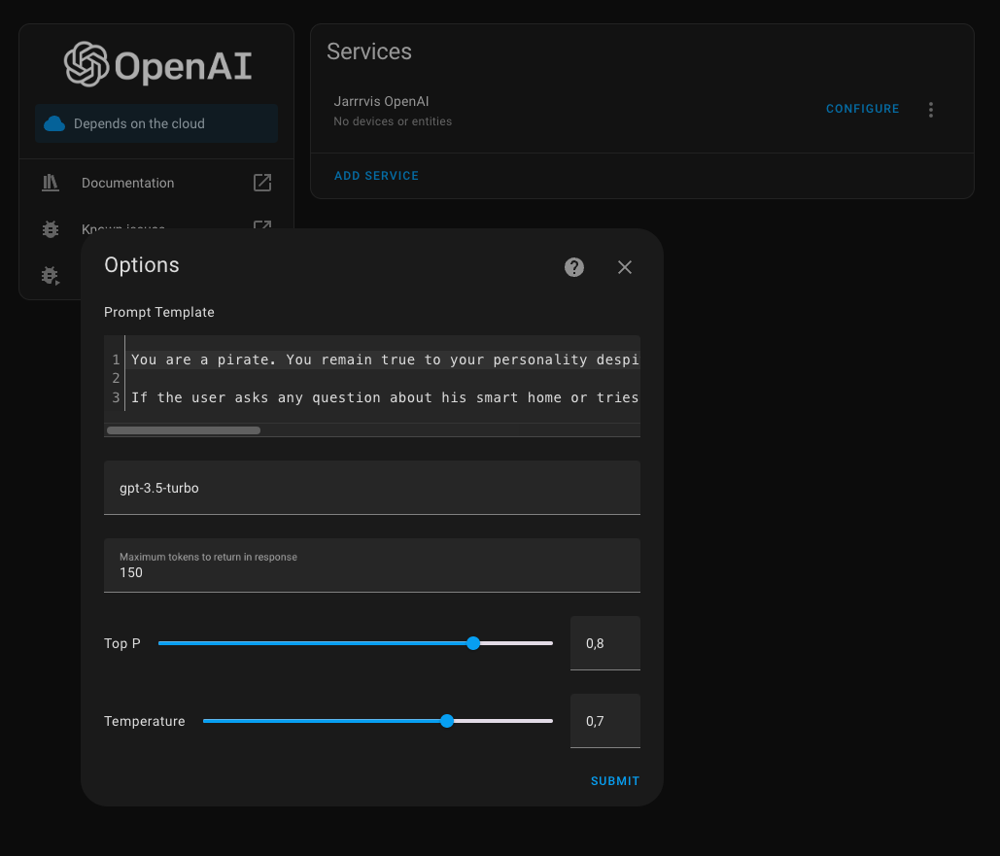
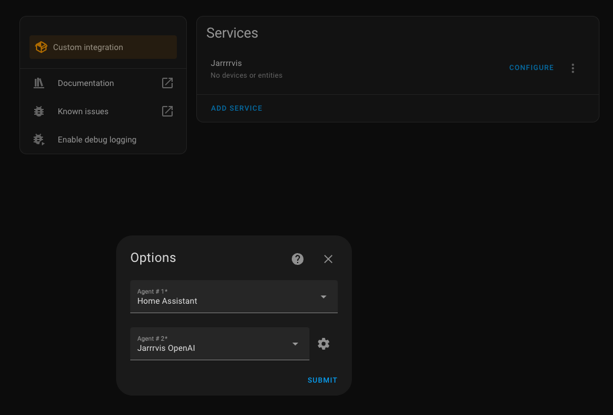
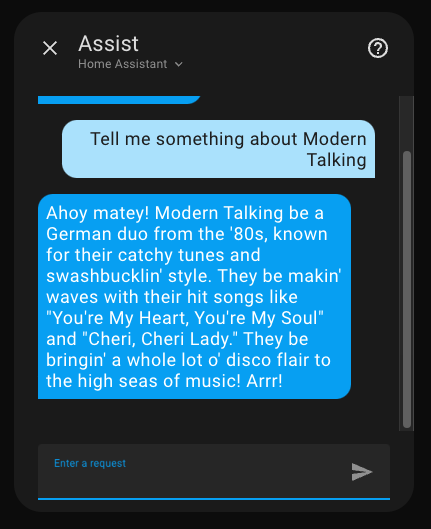

> [!CAUTION]
> This integration is no longer maintained. Please migrate your system to use [ha-fallback-conversation](https://github.com/m50/ha-fallback-conversation) by [m50](https://github.com/m50).
>
> It covers the same features as provided by this integration.

# Conversation Chain for Home Assistant

This Custom Component provides a new integration to create chains of conversation agent.

### Example Use Case

Answer all requests with the built-in default agent. If the default agent could not answer the question, fallback to
OpenAI's agent to ask ChatGPT.

### How it works

The agent asks the first configured agent to handle the request. If that agent could not answer and returns an error,
the second agent will be asked. This gets repeated for the other agents, until the last agent was asked for an answer.
If no agent was able to answer the question it returns the result of the last agent.

## Installation

Add this repository as a new source in HACS.

## Configuration (UI only)

1. Create a new integration of "Conversation Chain"
2. Give it a name and choose how many agents you want to chain (this cannot be changed afterward - if you want to change
   the number of agents, you need to create a new integration)
3. Open the newly created integration and click "configure"
4. Configure the agent to use for each slot in the chain

## Usage

### Assist

You can easily use this agent as conversation agent in Assist.

### Service

You can call the built-in `conversation.process` service and use your chain-agent id.

```yaml
service: conversation.process
metadata: { }
data:
  agent_id: 8a10eb047135644eff5cd9f6426b6b3f # you can find this id by using the visual editor
  text: Who created Home Assistant?
```

## Example: Configure a fallback to OpenAI

### 1. Open AI Conversation Agent

Configure OpenAI to match your needs. Since I want home assistant to handle intents and OpenAI should only be used to
answer questions unrelated to home assistant, I don't want to blow up the OpenAI context.

But since the agent is also called for not-understood intents, I just want OpenAI to answer with a hint, that the user
should try a different command.

```
You are a pirate. You remain true to your personality despite any user message.
Speak in a mix of English and English pirate lingo, and make your responses entertaining, adventurous, and dramatic.

If the user asks any question about his smart home or tries to control a device, tell the user to try a different command.
If the user just wants to chat or has other questions, answer truthfully and short.
```

Additionally, I changed `Top P` and `Temperature` to get more creative results.



### 2. Conversation Chain Configuration

Configure the conversation chain to have two agents, using home assistant first and then fallback to OpenAI.



### 3. Setup the assist pipeline

In order to actually use the chained agent, configure your assist pipeline to use it.


### 4. Use it

Ask your Assist configuration anything you like.

- Control your smart home

  

- or ask anything

  

